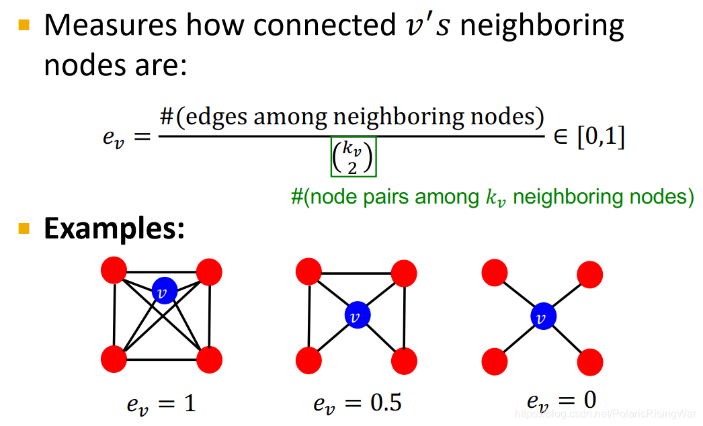
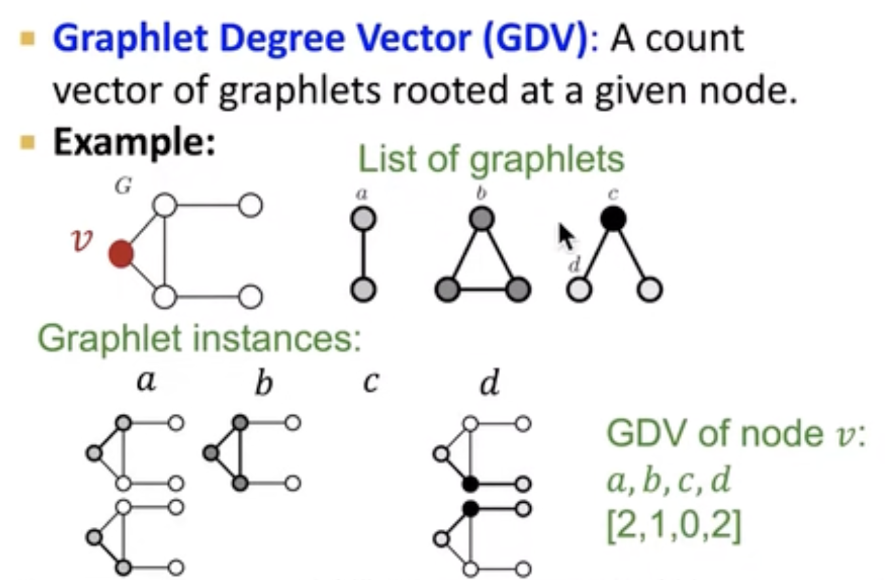

# SC224W图机器学习学习笔记

## 基本知识

- 无向图(Undirected)：

  具有无方向的链接

  对于建模和互惠关系很有用，比如合作、友谊、蛋白质的互相连接

  - 节点的度

    节点连接边的数量

    邻接矩阵一行或一列的值相加

  - 平均节点度

    两倍的边的数量处以节点的数量

- 有向图(Directed)：

  连接具有方向，来源方向和目的地

  电话、金融交易，有来有目的的连接

  - 入度 (in degree)

    指向节点的边数

    邻接矩阵一列的值相加

  - 出度(out degree)

    节点指向别的地方的边数

    邻接矩阵一行的值相加

- 二部图(Bipartite graph)

  A graph whose nodes can be divided into two disjion sets U and V shuch that every link connects a nodes in U to one in V; that is U and V are independent sets

  - 比如

    作者和文章

    演员和电影

    影评人和电影

    客户和购买的 产品

- 简单的表示图的方法
  1. 只表示边 list of edge，每条边简单的表示为二维向量，常用于深度学习框架，但很难进行图形分析
  2. 领接表，适用于稀疏矩阵

- 强连通图

  有向图G中，如果对于每一对vi、vj，vi≠vj，从vi到vj和从vj到vi都存在路径，则称G是强连通图。有向图中的极大强连通子图称做有向图的强连通分量。

  

## 传统方法中的图机器学习

-  传统的机器学习

  获取整个图具有的向量特征 $\rightarrow$ 训练经典的机器学习方法

#### 节点级预测

- node centrality $c_v$ 
  考虑了节点的重要性

  - **eigenvector centrality**：认为如果节点邻居重要，那么节点本身也重要

    因此节点 $v$ 的centrality是邻居centrality的加总：$c_v = \frac{1}{\lambda}\sum_{u \in N(v)}c_u$，其中$\lambda$是某个正数

    这是一种可以转换成矩阵运算的方法，$\lambda$可以看作是归一化因子，$c$是centrality向量，A是我们的图的邻接矩阵，则该表示可以表示为$\lambda c = Ac$，可以看出这是一种特征值、特征向量的方程式

    因为在这种问题中最大特征值永远是正数且唯一的，所以我们可以用最大特征向量来表示centrality

  - **betweenness** **centrality**：认为如果一个节点如果处于很多对节点的最短路径上。那么这个节点是重要的（#代表$the\ number\ of$ )
    $$
    c_v = \sum_{s \neq v\neq t}\frac{\#(shorest\ path \ between\ s \ and \ t \ that \ contain\ v)}{\#(shorest\ path \ between\ s \ and \ t )}
    $$

  - **closeness centrality**：如果认为一个节点和其他节点之间的距离最短，那么这个节点是重要的
    $$
    c_v = \frac{1}{\sum_{u\neq v}shorest\ path\ length\ etween\ u\ and\ v}
    $$

- **clustering coefficient 聚类系数**：衡量节点邻居的连接程度
  $$
  e_v = \frac{\#(edges\ among\ neighboring\ nodes)}{\begin{pmatrix} k_v\\ 2 \\ \end{pmatrix}}\in [0,1]
  $$
  其中分母表示的意思是组合数的写法，所以这个式子代表$v$邻居所构成的节点对，即潜在的连接数

  其中图一$e_v =6/6 = 1$，图二$e_v = 3/6 = 0.5$，图三$e_v = 0/6=0$

  通过观察可以看出，聚类系数实际上是在计算包括该节点的三角形的数量，实际上是一种有根异构连通子图

- **graphlets**：有根连通异构子图

  - **Graphlet Degree Vector(GDV)**：Graphlet-base features for nodes 

    A count vector of graphlets rooted at a given node. 

    

#### 连接级预测

